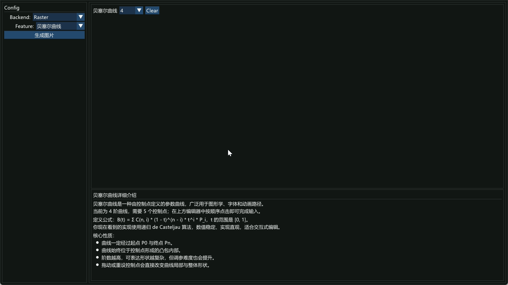
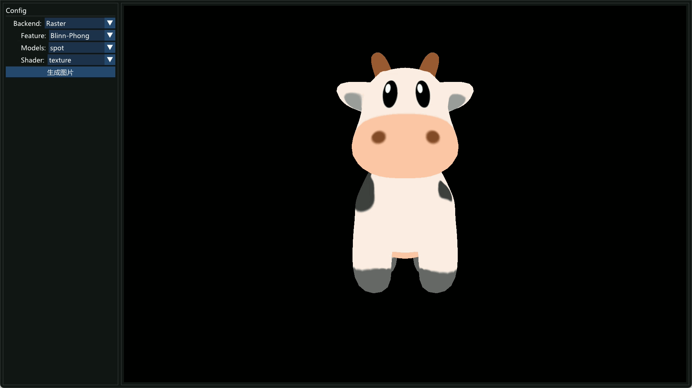
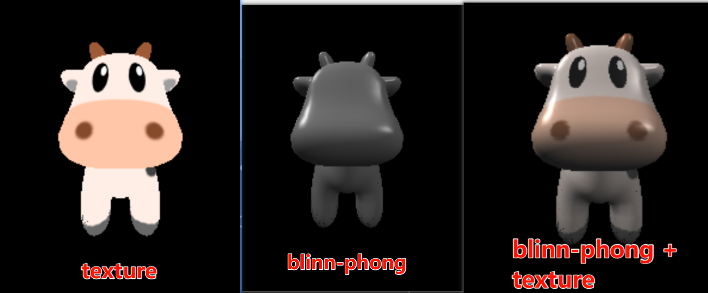
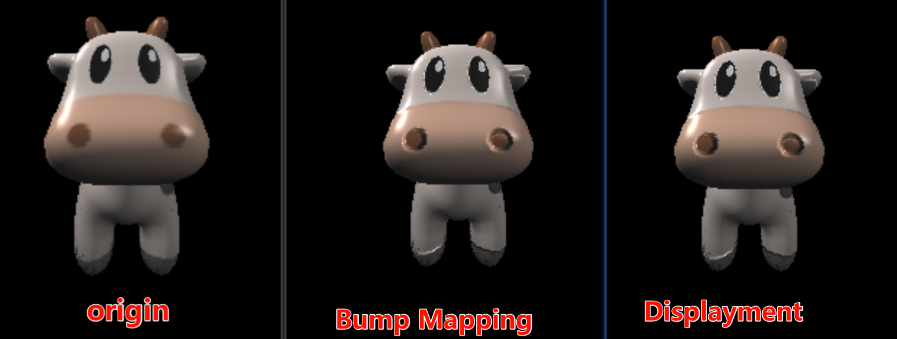
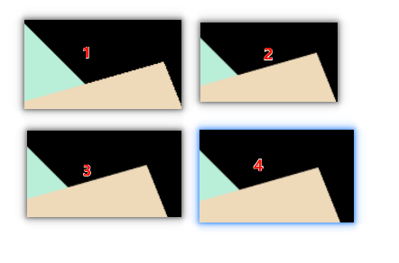
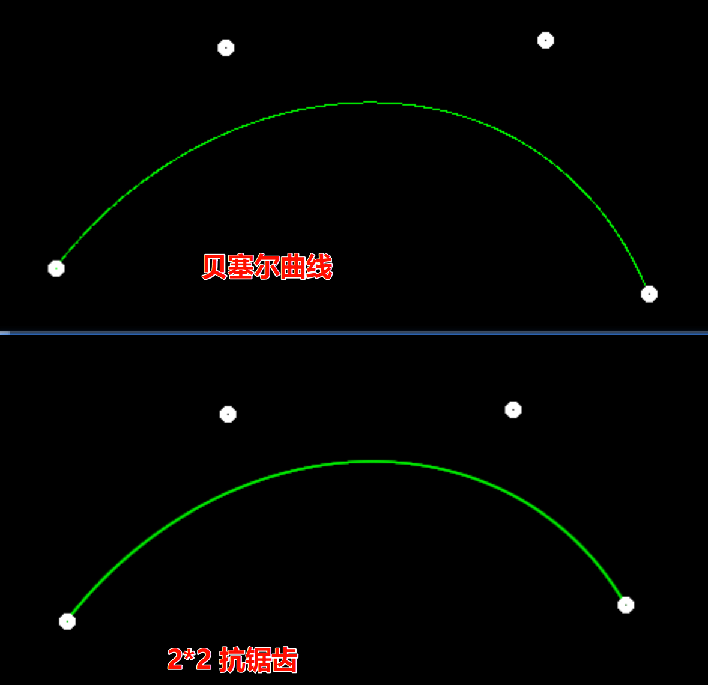

# XXEngine

XXEngine 是一个基于 C++ 的图形学项目，当前集成了两条渲染后端：

- 软光栅化（CPU）
- OpenGL（实时交互）

项目使用 ImGui 构建统一配置面板，在同一窗口中完成功能切换、模型切换、着色效果选择与结果预览。

## 功能概览

- 软光栅化功能
  - 贝塞尔曲线绘制
  - Blinn-Phong 相关着色流程（`texture / normal / phong / bump / displacement`）
  - 可选择模型并进行离屏渲染结果展示
- OpenGL 功能
  - 最小三角形回退渲染（MVP 验证）
  - 模型加载与显示（当前支持 OBJ 与 glTF）
  - 纹理显示与 Blinn-Phong / PBR shader 路径
  - 基于 `models.json` 的模型可用 Shader 列表切换
  - 鼠标/键盘交互（相机平移、模型平移/旋转）
  - 工具栏支持一键重置与自动旋转开关

## 效果展示


<table>
  <tr>
    <td align="center" width="33%">
      
      <br/>
      <sub>图 1：贝塞尔曲线功能演示</sub>
    </td>
    <td align="center" width="33%">
      
      <br/>
      <sub>图 2：软光栅化器渲染演示</sub>
    </td>
    <td align="center" width="33%">
      
      <br/>
      <sub>图 3：OpenGL Blinn-Phong 演示</sub>
    </td>
  </tr>
</table>


<table>
  <tr>
    <td align="center" width="50%">
      
      <br/>
      <sub>图 4：Blinn-Phong 效果对比</sub>
    </td>
    <td align="center" width="50%">
      
      <br/>
      <sub>图 5：Bump 效果对比</sub>
    </td>
  </tr>
</table>

<table>
  <tr>
    <td align="center" width="50%">
      
      <br/>
      <sub>图 6：MSAA 效果对比</sub>
    </td>
    <td align="center" width="50%">
      
      <br/>
      <sub>图 7：贝塞尔曲线抗锯齿效果对比</sub>
    </td>
  </tr>
</table>

## 项目结构

```text
XXEngine/
├─ lib/                      # 第三方库（ImGui、stb 等）
├─ src/
│  ├─ bezier/                # 贝塞尔曲线相关
│  ├─ loaders/               # 模型加载抽象层（OBJ / glTF，可扩展）
│  ├─ models/                # 模型资源与 models.json
│  ├─ OpenGL/                # OpenGL 后端与 shader
│  ├─ rasterizer/            # 软光栅化核心代码
│  ├─ ConfigPanel.*          # 左侧配置面板
│  └─ main.cpp               # 程序入口与主循环
├─ XXEngine.sln
└─ XXEngine.vcxproj
```

## 依赖环境

当前工程以 Windows + Visual Studio 为主：

- Visual Studio 2022（MSVC v143）
- C++17
- OpenGL (`opengl32.lib`)
- GLFW 3.4（项目配置使用 Win64 预编译包）
- Eigen3
- OpenCV（用于读取 `models.json`，当前工程链接 `opencv_world4120d.lib`）
- tinygltf（已通过 include 路径接入）

说明：以上路径在 `XXEngine.vcxproj` 中按本机绝对路径配置，请按你的本地安装位置调整 `IncludePath / LibraryPath / AdditionalDependencies`。

## 构建与运行

1. 使用 Visual Studio 2022 打开 `XXEngine.sln`
2. 选择 `Debug | x64` 配置（当前依赖项配置最完整）
3. 构建并运行 `XXEngine` 项目

## 使用说明

程序启动后：

- 左侧 `Config` 面板
  - `Backend`：
    - `Raster`：软光栅化路径
    - `OpenGL`：OpenGL 路径
  - `Models`：模型选择（在 Raster/OpenGL 下均可用）
  - `Shader`（OpenGL）：位于 `Models` 下方，仅显示当前模型支持的 shader（来自 `models.json`）
- 右侧渲染区域
  - Raster：显示软光栅化结果
  - OpenGL：显示实时渲染结果与工具栏（重置/自动旋转）

OpenGL 交互（当前逻辑）：

- 鼠标左键拖动：移动相机
- 鼠标右键拖动：旋转模型
- `W/A/S/D`：移动模型
- `Ctrl + W/A/S/D`：旋转模型
- `Ctrl + 鼠标移动`：旋转模型
- 工具栏按钮：
  - `Reset Camera/Model`：重置相机和模型位姿
  - `Auto Rotate`：自动旋转开关

## 模型配置（models.json）

模型列表由 `src/models/models.json` 驱动，关键字段：

- `shader`：Shader 字典，定义 `id -> 名称` 映射（供 UI 展示）
- `id`：模型 ID
- `name`：显示名称
- `loaders`：加载器类型（如 `obj` / `gltf`）
- `modelpath`：模型路径（相对 `models.json`）
- `opengl_rotation_deg`：OpenGL 下模型初始旋转矫正（XYZ）
- `shaders`：该模型支持的 shader id 数组（对应上方 `shader` 字典）
- `texturespath`：纹理路径数组
  - 对 PBR（DamagedHelmet）默认约定顺序：`albedo / metalRoughness / normal / AO / emissive`

说明：

- OpenGL 下 `opengl_rotation_deg` 会在模型加载后应用；修改后需重启程序生效。
- glTF 模型不再硬编码翻转 Y 轴，姿态矫正以 `opengl_rotation_deg` 为准。

示例：

```json
{
  "shader": {
    "sum": 2,
    "1": "BlinnPhong",
    "2": "PBR"
  },
  "models": [
    {
      "id": 1,
      "name": "spot",
      "loaders": "obj",
      "modelpath": "./spot/spot_triangulated_good.obj",
      "opengl_rotation_deg": [180.0, 0.0, 0.0],
      "shaders": ["1"],
      "texturespath": ["./spot/spot_texture.png"]
    },
    {
      "id": 2,
      "name": "DamagedHelmet",
      "loaders": "gltf",
      "modelpath": "./DamagedHelmet/glTF/DamagedHelmet.gltf",
      "opengl_rotation_deg": [0.0, 0.0, 180.0],
      "shaders": ["2", "1"],
      "texturespath": [
        "./DamagedHelmet/glTF/Default_albedo.jpg",
        "./DamagedHelmet/glTF/Default_metalRoughness.jpg",
        "./DamagedHelmet/glTF/Default_normal.jpg",
        "./DamagedHelmet/glTF/Default_AO.jpg",
        "./DamagedHelmet/glTF/Default_emissive.jpg"
      ]
    }
  ]
}
```

## 可扩展方向

- 在 `src/loaders` 新增更多格式加载器（如 FBX、更多 glTF 变体）
- 在 `src/OpenGL/shaders` 下扩展更多着色效果
- 将 OpenGL 与 Raster 的材质/灯光参数统一为同一套配置结构

## 已知说明

- 当前工程主要在 Windows（`Debug | x64`）配置下验证。
- 如果遇到编译报错，优先检查第三方依赖路径和库名是否与本地环境一致。
